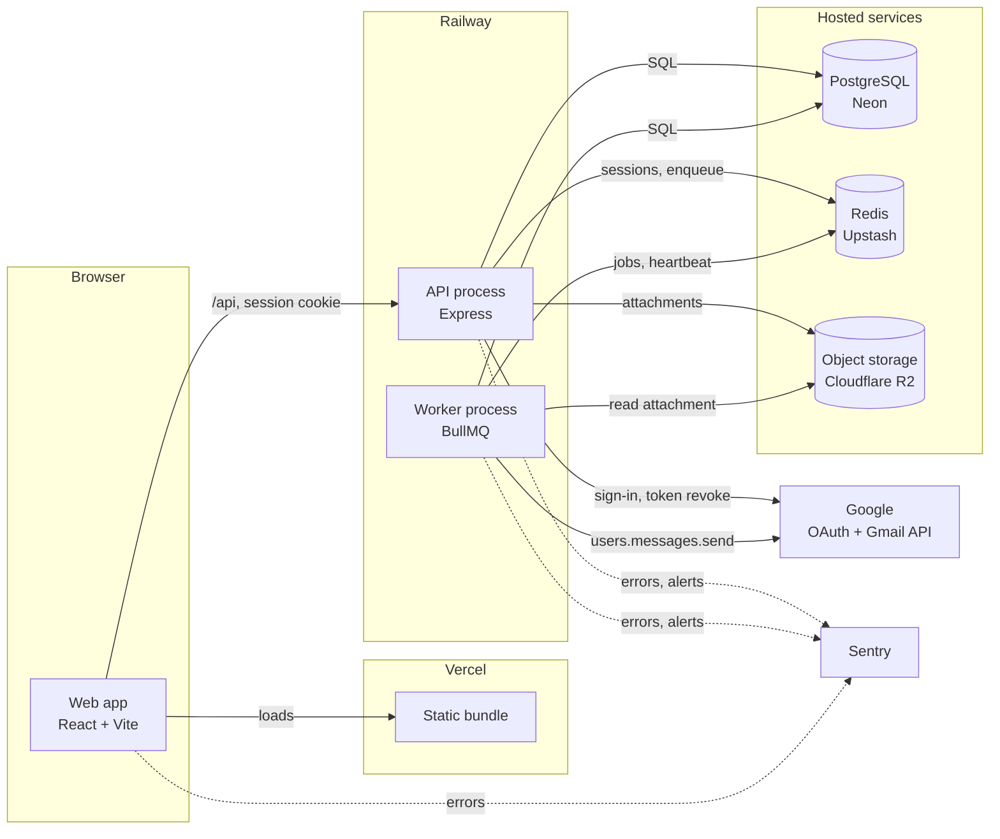
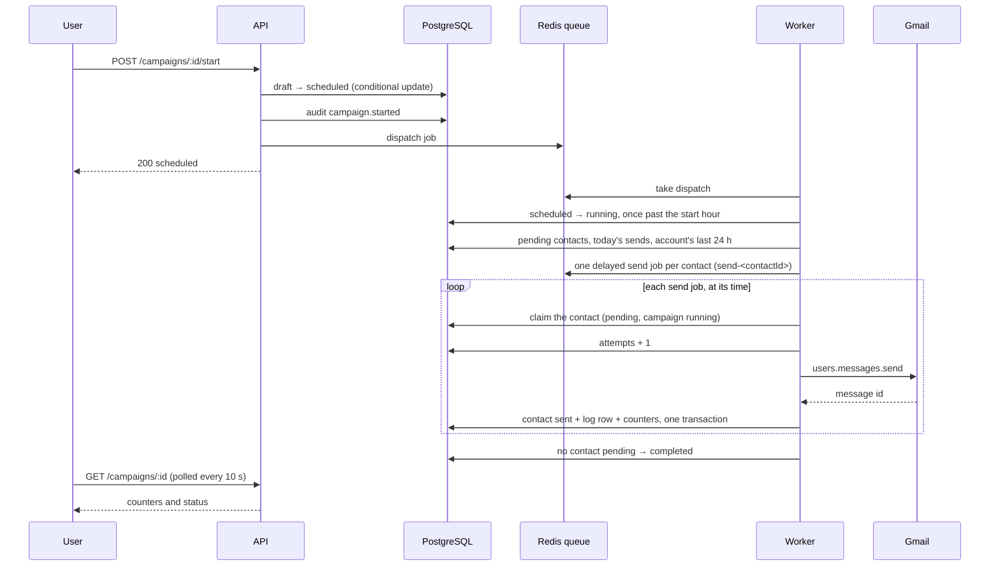

# Architecture

What runs where, what talks to what, and how a campaign becomes messages. For the reasoning behind the send engine's rules, read [send-engine.md](send-engine.md); for security, [security.md](security.md); for incidents, [RUNBOOK.md](RUNBOOK.md).

---

## Components



| Component  | Code                                                                    | Responsibility                                                                                                                                                                                     |
| ---------- | ----------------------------------------------------------------------- | -------------------------------------------------------------------------------------------------------------------------------------------------------------------------------------------------- |
| Web app    | `frontend/`                                                             | Every screen. Talks only to `/api`, with credentials. Parses the CSV in the browser to show the column mapping before anything is sent.                                                            |
| API        | `backend/src/index.ts`                                                  | Sign-in, campaigns, contacts, attachments, statistics, account export and deletion. Validates, authorizes, writes. Never sends an email.                                                           |
| Worker     | `backend/src/worker.ts`                                                 | Plans every campaign at the second one becomes sendable (fifteen minutes at the longest) and on demand, sends one message at a time, purges old logs daily, writes a heartbeat every five minutes. |
| PostgreSQL | `backend/migrations/`                                                   | `users`, `campaigns`, `contacts`, `logs`, `audit_events`. The unique index on `sent` log rows is the last guard against a duplicate send.                                                          |
| Redis      |                                                                         | Sessions (node-redis, `cm:sess:`), the `campaign` queue (ioredis, BullMQ), the worker heartbeat.                                                                                                   |
| R2         | `services/storage.ts`                                                   | One attachment per campaign under `campaigns/<id>/`, private, read by the backend only.                                                                                                            |
| Google     | `services/gmail.ts`, `services/tokenRefresh.ts`                         | OAuth sign-in with the `gmail.send` scope; each message leaves from the user's own mailbox.                                                                                                        |
| Sentry     | `services/errorReporting.ts`, `frontend/src/services/errorReporting.ts` | Errors and alerts, scrubbed of addresses and tokens. Off without a DSN.                                                                                                                            |

The API and the worker are separate processes so a deploy of one does not cut the other mid-send, and a burst of sends never competes with a user's request for a database connection.

---

## Backend layers

```text
routes/       validate the payload with a schema, check ownership, delegate
middleware/   authentication, terms gate, error handler
services/     business rules; the only layer that touches the database or an external API
jobs/         BullMQ queue, processors, idle sleep, heartbeat
config/       environment, session, security headers, request logging
```

Every campaign route resolves the campaign for the signed-in user in the query itself, so another user's campaign answers 404, the same as one that does not exist.

---

## A campaign, from launch to the last message



What each step protects against:

- **The job id is the contact id**: planning twice does not queue a contact twice.
- **The claim** is one conditional `UPDATE`: two workers cannot both take a contact, and a paused campaign's queued jobs find nothing to do.
- **`attempts` counted before the call**: a worker killed between Gmail's answer and the record leaves a recognizable contact, marked failed with an unknown outcome and never retried.
- **The unique index** on `sent` log rows: even a bug in all of the above cannot record a second send.
- **Two ceilings**, the campaign's daily pace and the account's 450 over 24 hours, checked at planning and again before each send. Reaching the account ceiling holds the sending without changing the campaign's status.

---

## Sign-in and sessions

1. The web app sends the browser to `/api/auth/google`. Passport redirects to Google with the `gmail.send` scope and a state stored in the session.
2. Google redirects back to `/api/auth/google/callback`. The user row is upserted; the access and refresh tokens are encrypted with AES-256-GCM before they are stored. A later sign-in without a refresh token keeps the stored one.
3. The session in Redis holds only the user id. The cookie, `cm.sid`, is httpOnly, `sameSite: lax` (a strict cookie is withheld on Google's redirect and breaks the state check), and `secure` in production.
4. Before any campaign route, the terms gate checks that the user accepted the current terms version.
5. When the worker needs to send, `createAccessTokenProvider` decrypts the token and renews it when it is about to expire. `invalid_grant` pauses the campaign and asks the user to reconnect; any other failure is retried.

---

## Observability

| Signal    | Where                                                                                                                                                                                                                       |
| --------- | --------------------------------------------------------------------------------------------------------------------------------------------------------------------------------------------------------------------------- |
| Logs      | JSON on stdout (pino). Every request line has `req.id` (also returned as `x-request-id`); every job line has `jobId`, `campaignId`, `contactId`. Cookies, authorization headers, tokens and query strings are never logged. |
| Errors    | Sentry, tagged `service: api` or `worker`, with the request or job context and the user as an id only.                                                                                                                      |
| Liveness  | `GET /api/health`                                                                                                                                                                                                           |
| Readiness | `GET /api/ready`: database, session store and queue checks; queue depth; worker heartbeat age.                                                                                                                              |
| Alerts    | Logged at error level with an `alert` field and sent to Sentry: send error rate above 5 % over an hour (from the worker), queue stuck for 15 minutes and worker silent for 15 minutes (from the API).                       |

---

## Costs that shaped the design

- **Upstash counts every Redis command.** One queue instead of two, a worker that sleeps when nothing is due (1 command a minute instead of 12), the fifteen-minute plan on a timer rather than a repeatable job, and the worker kept out of `npm run dev`.
- **Neon suspends an idle database after five minutes.** The send error rate check runs right after the worker's plan, when the database is already awake, instead of on its own timer.
- **Google's verification** grows with each sensitive scope. Attachments are on R2 rather than Google Drive, and no read access to the mailbox is requested.

---

## Tests

| Level       | Where                                                     | Runs against                                                                                                   |
| ----------- | --------------------------------------------------------- | -------------------------------------------------------------------------------------------------------------- |
| Unit, route | `*.test.ts` beside the code                               | Fakes, in process                                                                                              |
| Integration | `*.integration.test.ts`, `routes/api.integration.test.ts` | A throwaway PostgreSQL schema (`scripts/withTestDatabase.mjs`)                                                 |
| End-to-end  | `e2e/journey.spec.ts`                                     | Chromium, the web app, and `src/e2e/server.ts`: the real API with Google sign-in, Gmail and the queue replaced |
